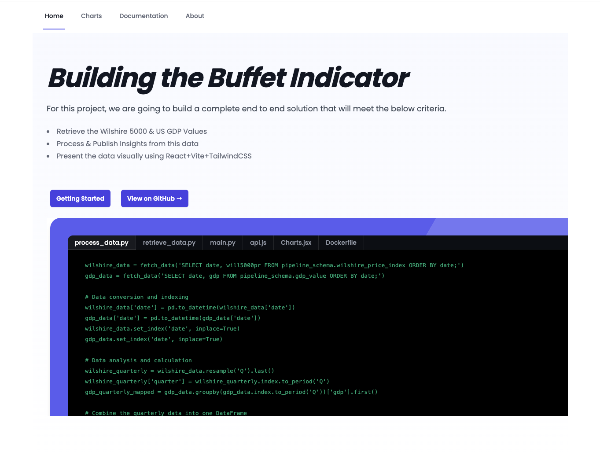

# Buffet Indicator project
This is an example end-to-end project to develop a process and the necessary tools to support retrieving, processing, publishing and presentation of the data to understand the economic outlook based on Buffets Indicator rule.



### Frontend Built With
* [![React][React.js]][React-url]
* [![TailwindCSS][TailwindCSS-shield]][TailwindCSS-url]
* [![ViteJS][Vitejs-shield]][Vitejs-url]
* [![Docker][Docker-shield]][Docker-url]

### Backend API Built With
* [![Python][Python-shield]][Python-url]
* [![FastAPI][FastAPI-shield]][FastAPI-url]
* [![PyTest][PyTest-shield]][PyTest-url]
* [![SQLAlchemy][SQLAlchemy-shield]][SQLAlchemy-url]
* [![Docker][Docker-shield]][Docker-url]

### Other tools used
* [![GitHub][GitHub-shield]][GitHub-url]
* [![PostgreSQL][PostgreSQL-shield]][PostgreSQL-url]
* [![PyCharm][PyCharm-shield]][PyCharm-url]
* [![WebStorm][WebStorm-shield]][WebStorm-url]
* [![Pandas][Pandas-shield]][Pandas-url]

<!-- GETTING STARTED -->
## Getting Started

This tooling includes a Docker Compose file, as well as several Dockerfile definition files.  If using these containers to run this project, you should not need to install anything.
Where needed, I will note any credentials and/or signup's necessary to achieve the project results.


The overarching process that this tool will follow can be seen in the flowchart below.


The architectural design can be found below


# Usage
To run the complete stack, execute the following command from a terminal in the top-level project directory.
```shell
make dev
```
To populate the `webapp_schema.market_*` tables after the initial build, you will need to run the following.
```shell
cd pipeline
python process_data.py
```
## Troubleshooting
Notes regarding troubleshooting will be logged here


<!-- MARKDOWN LINKS & IMAGES -->
<!-- https://www.markdownguide.org/basic-syntax/#reference-style-links -->
[contributors-shield]: https://img.shields.io/github/contributors/github_username/repo_name.svg?style=for-the-badge
[contributors-url]: https://github.com/github_username/repo_name/graphs/contributors
[forks-shield]: https://img.shields.io/github/forks/github_username/repo_name.svg?style=for-the-badge
[forks-url]: https://github.com/github_username/repo_name/network/members
[stars-shield]: https://img.shields.io/github/stars/github_username/repo_name.svg?style=for-the-badge
[stars-url]: https://github.com/github_username/repo_name/stargazers
[issues-shield]: https://img.shields.io/github/issues/github_username/repo_name.svg?style=for-the-badge
[issues-url]: https://github.com/github_username/repo_name/issues
[license-shield]: https://img.shields.io/github/license/github_username/repo_name.svg?style=for-the-badge
[license-url]: https://github.com/github_username/repo_name/blob/master/LICENSE.txt
[linkedin-shield]: https://img.shields.io/badge/-LinkedIn-black.svg?style=for-the-badge&logo=linkedin&colorB=555
[linkedin-url]: https://linkedin.com/in/linkedin_username
[React.js]: https://img.shields.io/badge/React-20232A?style=for-the-badge&logo=react&logoColor=61DAFB
[React-url]: https://reactjs.org/
[Docker-shield]:https://img.shields.io/static/v1?style=for-the-badge&message=Docker&color=2496ED&logo=Docker&logoColor=FFFFFF&label=
[Docker-url]: https://www.docker.com/
[TailwindCSS-shield]: https://img.shields.io/static/v1?style=for-the-badge&message=Tailwind+CSS&color=222222&logo=Tailwind+CSS&logoColor=06B6D4&label=
[TailwindCSS-url]: https://tailwindcss.com
[Vitejs-shield]: https://img.shields.io/static/v1?style=for-the-badge&message=Vite&color=646CFF&logo=Vite&logoColor=FFFFFF&label=
[Vitejs-url]: https://vitejs.dev/guide/
[Python-shield]: https://img.shields.io/static/v1?style=for-the-badge&message=Python&color=3776AB&logo=Python&logoColor=FFFFFF&label=
[Python-url]: https://www.python.org
[PyTest-shield]: https://img.shields.io/static/v1?style=for-the-badge&message=Pytest&color=0A9EDC&logo=Pytest&logoColor=FFFFFF&label=
[PyTest-url]: https://docs.pytest.org/en/8.0.x/
[SQLAlchemy-shield]: https://img.shields.io/static/v1?style=for-the-badge&message=SQLAlchemy&color=D71F00&logo=SQLAlchemy&logoColor=FFFFFF&label=
[SQLAlchemy-url]: https://www.sqlalchemy.org

[PostgreSQL-shield]: https://img.shields.io/static/v1?style=for-the-badge&message=PostgreSQL&color=4169E1&logo=PostgreSQL&logoColor=FFFFFF&label=
[PostgreSQL-url]: https://www.postgresql.org
[WebStorm-shield]: https://img.shields.io/static/v1?style=for-the-badge&message=WebStorm&color=000000&logo=WebStorm&logoColor=FFFFFF&label=
[WebStorm-url]: https://www.jetbrains.com/webstorm/
[PyCharm-shield]: https://img.shields.io/static/v1?style=for-the-badge&message=PyCharm&color=000000&logo=PyCharm&logoColor=FFFFFF&label=
[PyCharm-url]: https://www.jetbrains.com/pycharm/
[GitHub-shield]:https://img.shields.io/static/v1?style=for-the-badge&message=GitHub&color=181717&logo=GitHub&logoColor=FFFFFF&label=
[GitHub-url]: https://github.com
[FastAPI-shield]:https://img.shields.io/static/v1?style=for-the-badge&message=FastAPI&color=009688&logo=FastAPI&logoColor=FFFFFF&label=
[FastAPI-url]: https://fastapi.tiangolo.com

[Pandas-shield]:https://img.shields.io/badge/pandas-%23150458.svg?style=for-the-badge&logo=pandas&logoColor=white
[Pandas-url]: https://pandas.pydata.org/